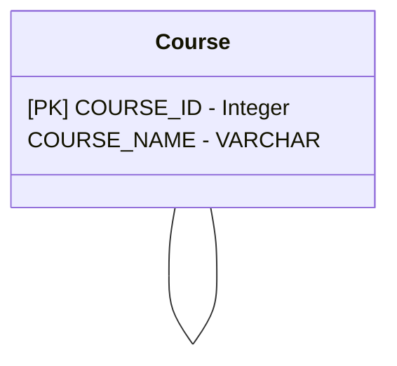
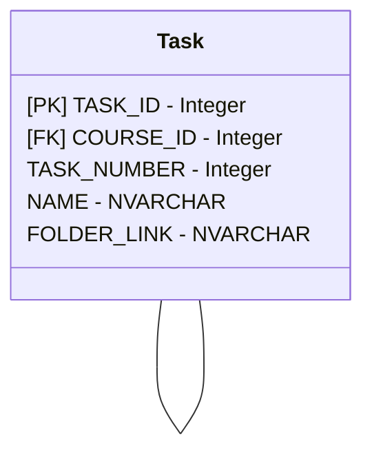
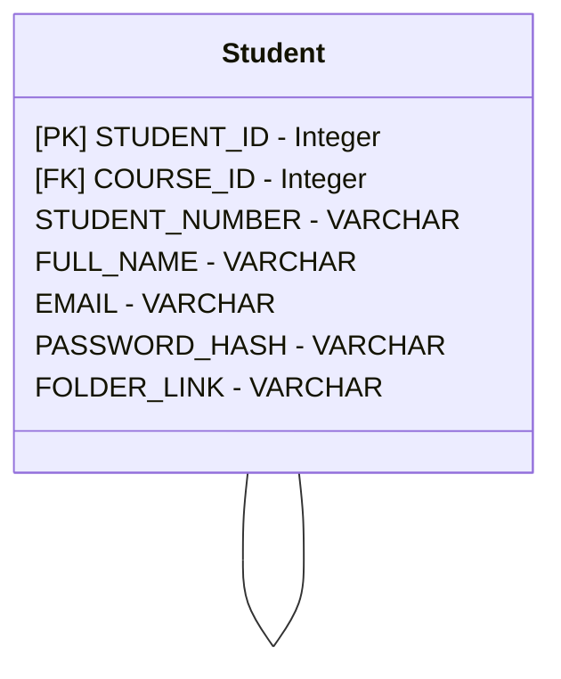
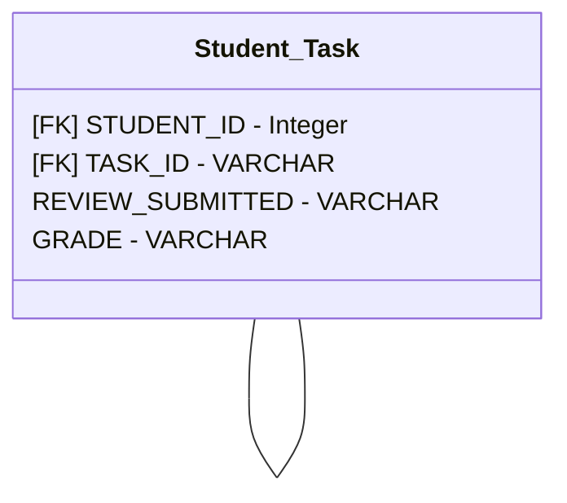
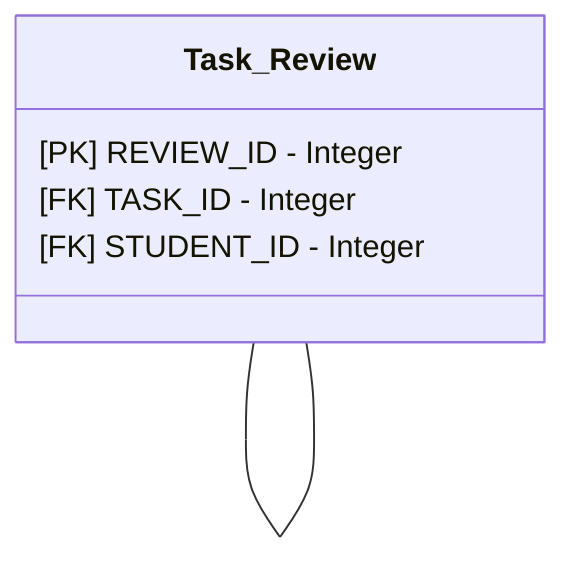

## Table of Content
- [Introduction](#Introduction)
- [Sytem Overview](#system-overview)
	- [Summary](#summary)
	- [Design](#design)
- [Implementation](#Implementation)
	- [Requirements](#requirements)
	- [Getting Started](#get-started)
	- [Environment Variables](#environment-variables)
- [Documentation](#documentation)


## Introduction
This is a small demo application that simulates a more optimised flow for students uploading their tasks and reviewers receiving and reviewing the work. 

The system is made up of two parts, the API and Frontend application

## System Overview

### Summary
The Bogammar API is an API designed to make it easier for students and reviewers to work with data stored in Dropbox by removing the need for them to jump between their respective platforms and Dropbox. 

The Bogrammar API allows for the following:
##### Students
- Uploading work to dropbox
- Downloading task and course material from dropbox
- Requesting reviews
- Getting course tasks

##### Reviewers
- View review backlog
- Download a students work from dropbox
- Submit reviews

### Design

#### Dropbox Folder Structure
```markdown
Bogrammar
  Courses
    SE2023
      Task1
      Task2
      Task3
  Students
    ST000000
      Work
        SE2023
          Task1
          Task2
          Task3
    
```

The dropbox folder is designed to reduce the number of folders that are stored by keeping one copy of the course content. The API allows for the content to be pulled down based on the course and the course the student is doing and the task they want to get.

The students folder follows the same principles as the course folder.

#### Database 










## Implementation
### Requirements
- Python
- FastAPI
- Uvicorn
- Startlette
- Dropbox
- Python-dotenv
- Python-multipart

### Get Started

*Clone the repo*
``` shell
git clone https://www.github.com/bonganibg/bogrammar-api.com
```

*Get into the directory*
``` shell
cd bogrammar
```

#### Local Machine

*Create Load Virtual Environment (on windows)*
``` shell
python venv venv
source -m ./venv/Scripts/activate
```

*Install Dependencies*
```python
pip install -r requirements.txt
```

*Create the database*
``` python
python load_database.py
```

*Run the application*
``` python
python main.py
```

#### Docker

*Build image*
``` shell
docker build -t bogrammar .
```

*Run run container*
``` shell
docker run bogrammar
```

#### Environment Variables
| Name | Description | Type |
| -- | -- | -- |
| `DBX_TOKEN` | Dropbox token, required to access dropbox api | `string` |
| `DATABASE_NAME` | Name of the database to connect to | `string` |
| `HOST` | IP address to host the uvicorn server | `string` |
| `PORT` | Port where the API will run | `number` |
| `RELOAD` | Enable automatic reloads for the API | `boolean` |

## Documentation
Navigate to `http://127.0.0.1:8000/redoc` or `http://127.0.0.1:8000/redoc` for API documentation


